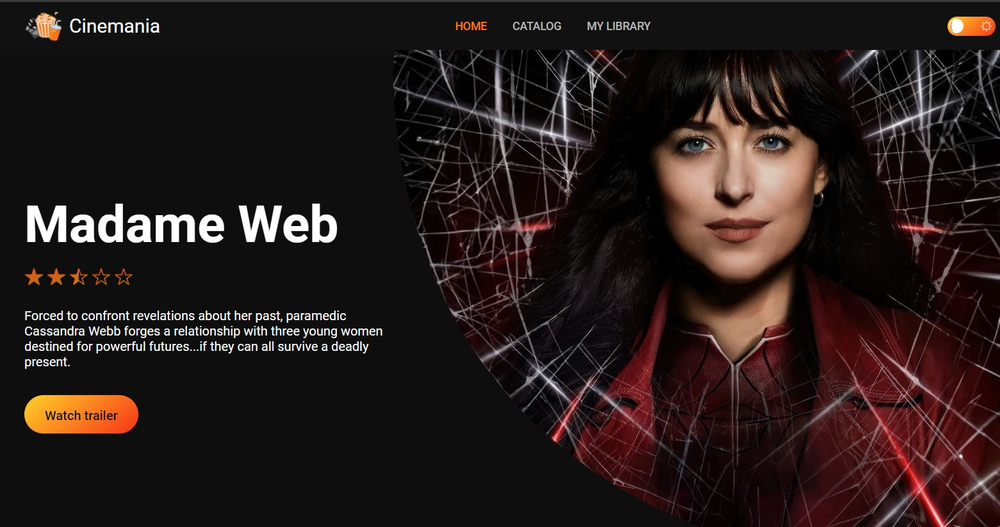
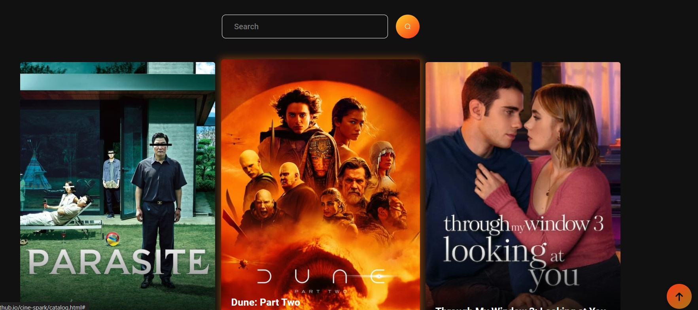
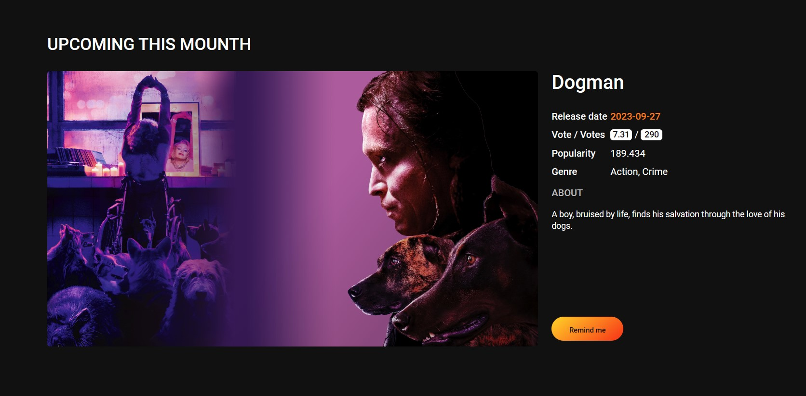
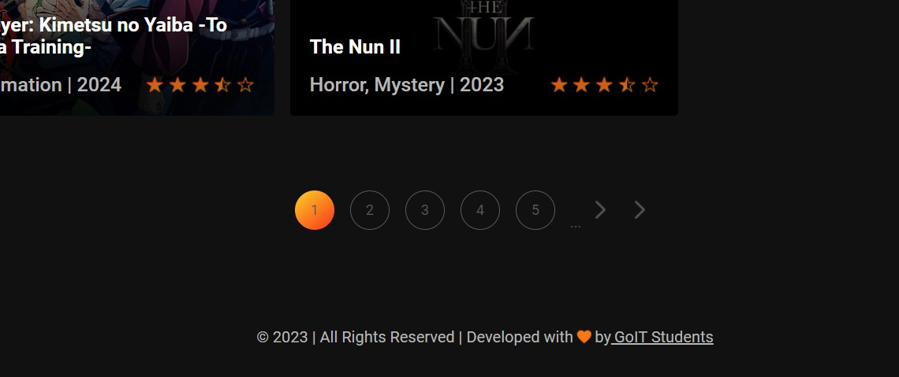

# Cine-spark

 

Cine-spark- is an application designed for enjoyable movie viewing. Here, you can relax and indulge in a movie of your choice.

### Explore and Search

 

Go to the catalog page and choose a movie to your liking

When you click on a movie, a modal window will open where you can read a detailed description of the movie, view the trailer and add the movie to your favorites.

You can view all your favorite films on the library page; there is also functionality for deleting from favorites.

The main page renders the movie of the day and the most popular movies.

And if you liked our site and also want to order a similar one for yourself, you can check out our development team.

## Link to the app

To use the application, please follow the link
[Cine-spark App](https://yuliamoore.github.io/cine-spark/).

<b>Thank you very much for choosing our application!</b>
  

<b>Technologies and tools used in development:</b> 

 

